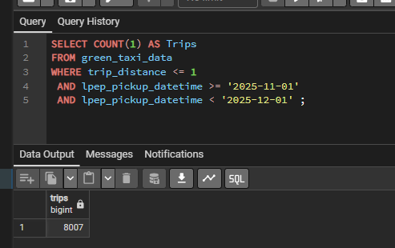
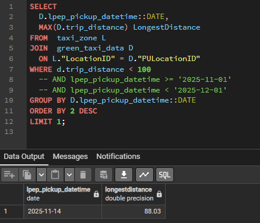
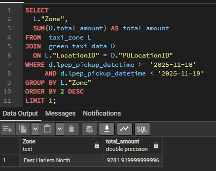
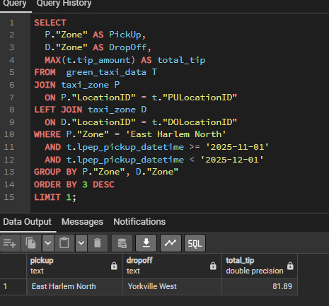

# Module 1 Homework: Docker & SQL

### 1. Understanding Docker images
Run docker with the python:3.13 image. Use an entrypoint bash to interact with the container.
```
root@3b6d44897b7a:/# pip --version
pip 25.3 from /usr/local/lib/python3.13/site-packages/pip (python 3.13)
```

### 2. Understanding Docker networking and docker-compose
Given the following docker-compose.yaml, what is the hostname and port that pgadmin should use to connect to the postgres database?
```
services:
  db:
    container_name: postgres
    image: postgres:17-alpine
    environment:
      POSTGRES_USER: 'postgres'
      POSTGRES_PASSWORD: 'postgres'
      POSTGRES_DB: 'ny_taxi'
    ports:
      - '5433:5432'
    volumes:
      - vol-pgdata:/var/lib/postgresql/data

  pgadmin:
    container_name: pgadmin
    image: dpage/pgadmin4:latest
    environment:
      PGADMIN_DEFAULT_EMAIL: "pgadmin@pgadmin.com"
      PGADMIN_DEFAULT_PASSWORD: "pgadmin"
    ports:
      - "8080:80"
    volumes:
      - vol-pgadmin_data:/var/lib/pgadmin

volumes:
  vol-pgdata:
    name: vol-pgdata
  vol-pgadmin_data:
    name: vol-pgadmin_data
```    

### 3. For the trips in November 2025, how many trips had a trip_distance of less than or equal to 1 mile?


### 4. Which was the pick up day with the longest trip distance? Only consider trips with trip_distance less than 100 miles. 


### 5. Which was the pickup zone with the largest total_amount (sum of all trips) on November 18th, 2025?


### 6. For the passengers picked up in the zone named "East Harlem North" in November 2025, which was the drop off zone that had the largest tip?
